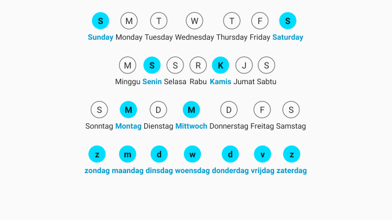

# daypicker
Simple Android View for picking multiple day in a week

## Features

*   Easily customizable
    ```xml
    <com.edgardrake.libs.views.daypicker.WeeklyDayPicker
        android:id="@+id/weeklyDayPicker"
        android:layout_width="wrap_content"
        android:layout_height="wrap_content"
        android:layout_gravity="center_horizontal"
        android:layout_marginTop="16dp"
        app:locale="id"
        app:dayFormat="shorthand"
        app:days="all"
        app:radius="32dp"
        app:mode="showAll"
        app:iconBackground="@drawable/selector_circle_blue"
        app:captionColor="@color/caption_color_blue" />
    ```

*   Support Localization
    

*   Demo
    <br/>
